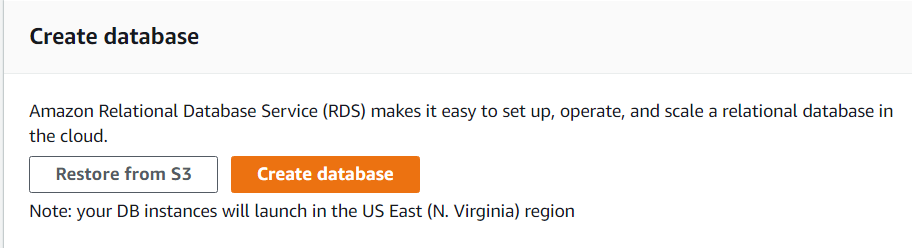
**select create database**

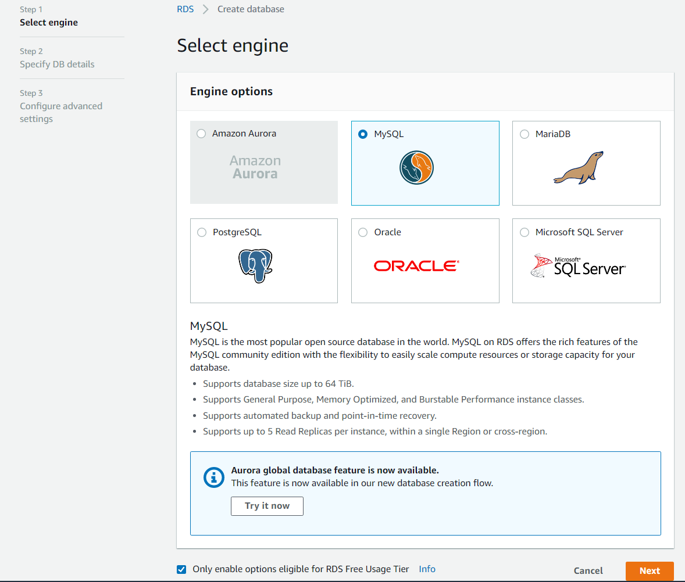
**after choosing mysql click on the free tier**

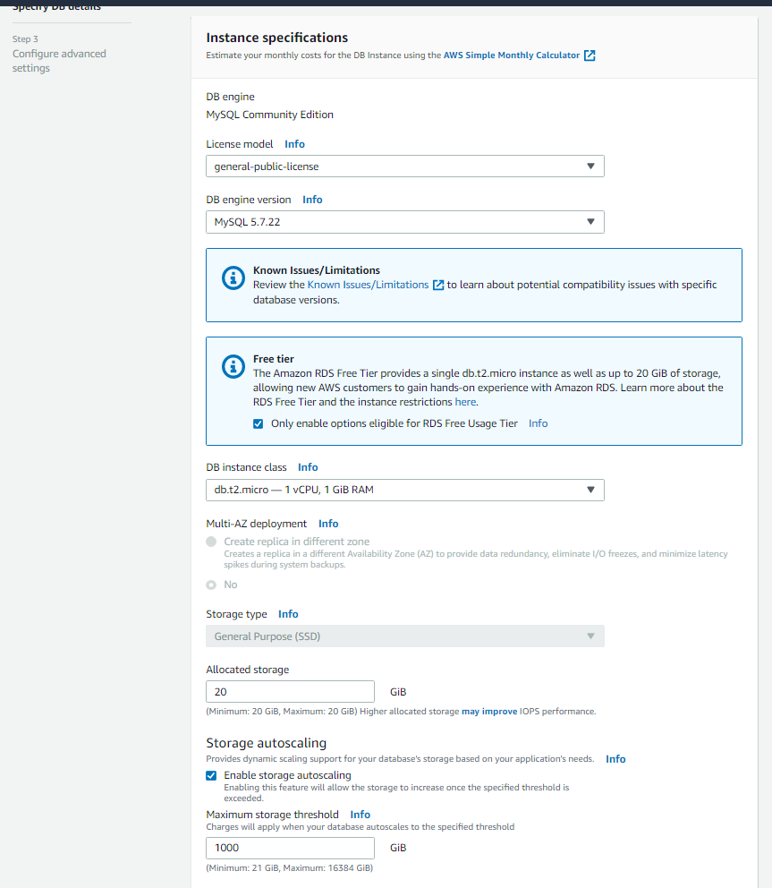

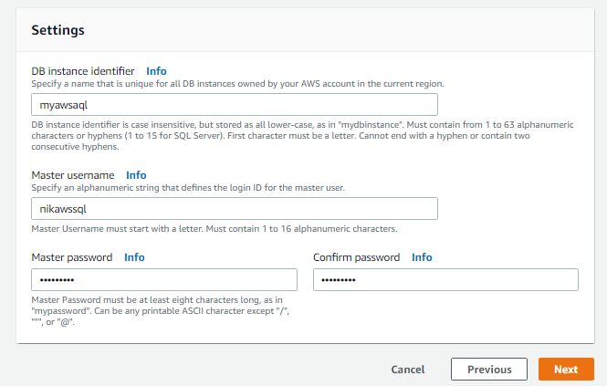

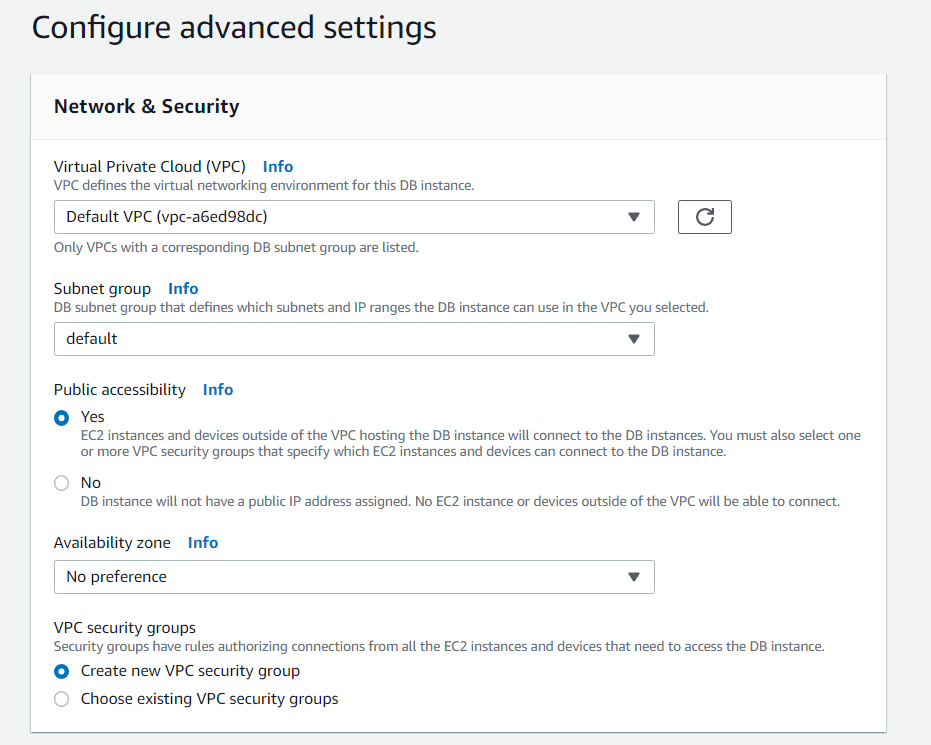

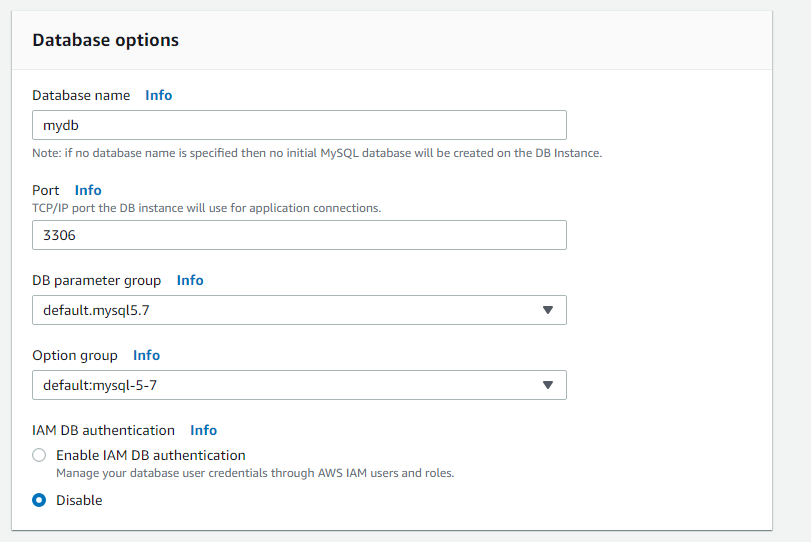

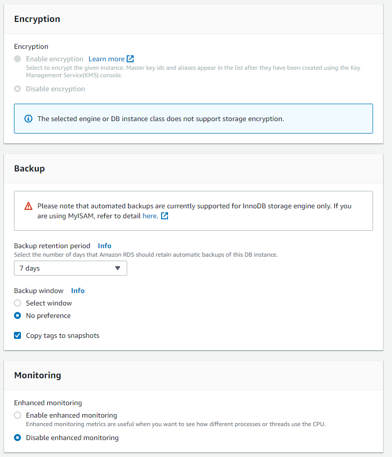

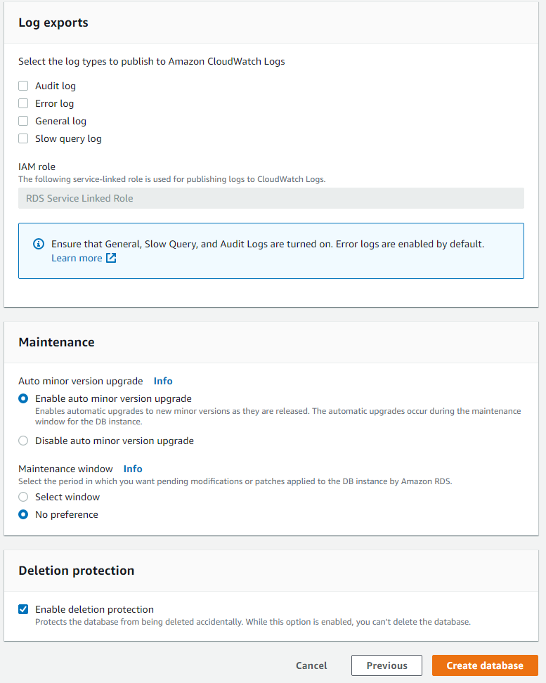

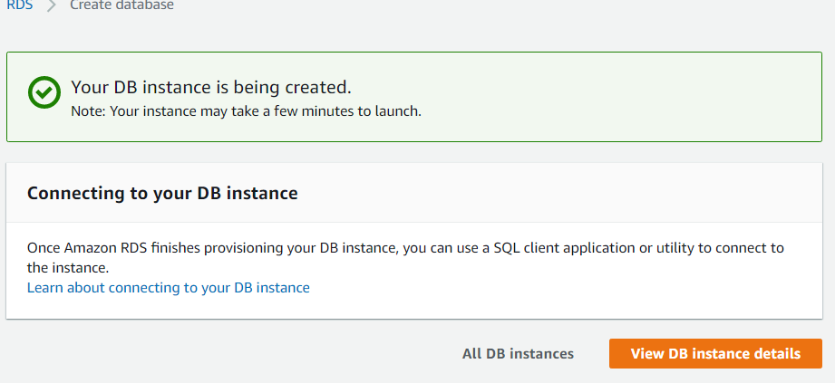

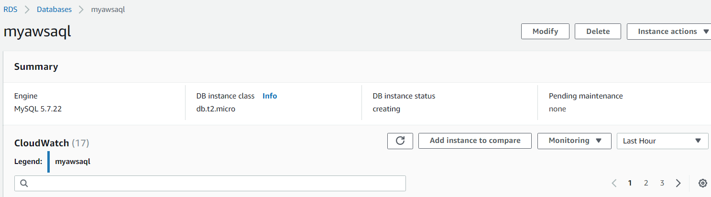


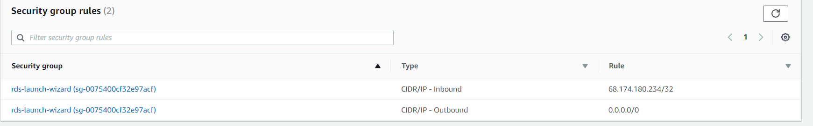

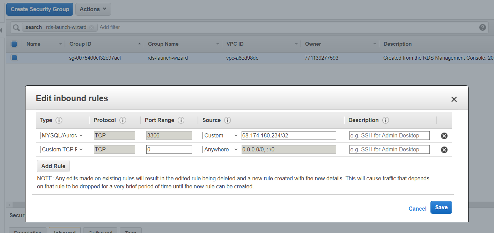

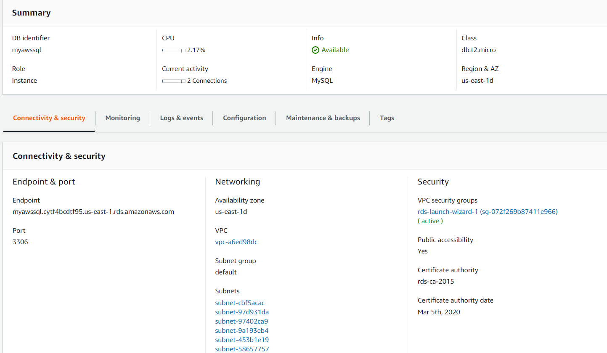

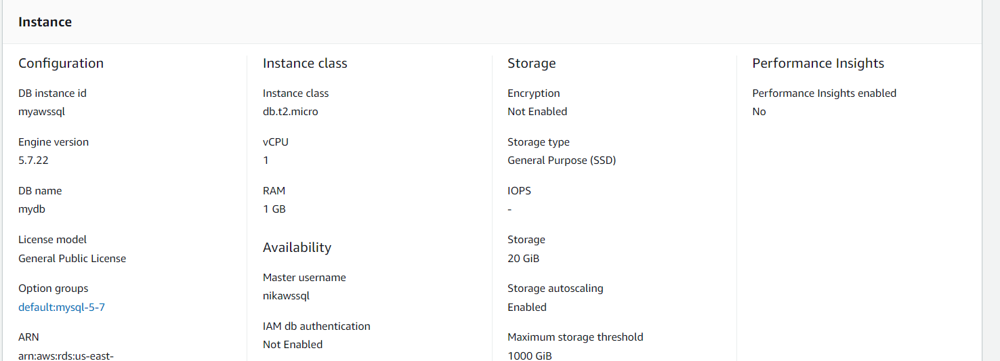


```python
!pip install pymysql
```

    Collecting pymysql
      Downloading https://files.pythonhosted.org/packages/ed/39/15045ae46f2a123019aa968dfcba0396c161c20f855f11dea6796bcaae95/PyMySQL-0.9.3-py2.py3-none-any.whl (47kB)
    Installing collected packages: pymysql
    Successfully installed pymysql-0.9.3
    

    WARNING: You are using pip version 19.1, however version 19.1.1 is available.
    You should consider upgrading via the 'python -m pip install --upgrade pip' command.
    


```python
import pymysql.cursors
import pandas as pd

import csv

from IPython.core.interactiveshell import InteractiveShell
InteractiveShell.ast_node_interactivity = "all"
```


```python
connection = pymysql.connect(
    host = 'myawssql.cytf4bcdtf95.us-east-1.rds.amazonaws.com',
    port = 3306,
    user = 'nikawssql',
    password = 'nikawssql',
    database='mydb'
    )
cursor = connection.cursor()
```

Let's see how many databases are here


```python
cursor.execute("""show databases""")

pd.read_sql("show databases", con = connection)
```


    6


<div>
<style scoped>
    .dataframe tbody tr th:only-of-type {
        vertical-align: middle;
    }

    .dataframe tbody tr th {
        vertical-align: top;
    }

    .dataframe thead th {
        text-align: right;
    }
</style>
<table border="1" class="dataframe">
  <thead>
    <tr style="text-align: right;">
      <th></th>
      <th>Database</th>
    </tr>
  </thead>
  <tbody>
    <tr>
      <th>0</th>
      <td>information_schema</td>
    </tr>
    <tr>
      <th>1</th>
      <td>innodb</td>
    </tr>
    <tr>
      <th>2</th>
      <td>mydb</td>
    </tr>
    <tr>
      <th>3</th>
      <td>mysql</td>
    </tr>
    <tr>
      <th>4</th>
      <td>performance_schema</td>
    </tr>
    <tr>
      <th>5</th>
      <td>sys</td>
    </tr>
  </tbody>
</table>
</div>


we can see that our 'mydb' database is there

And we currently have no tables in our database

Let's create tables, we will be using Transaction data
We will create 7 tables


[Guide to the Financial Data Set](https://web.archive.org/web/20161019192412/http://lisp.vse.cz/pkdd99/berka.htm)
    
[1999 Czech Financial Dataset - Real Anonymized Transactions](https://data.world/lpetrocelli/czech-financial-dataset-real-anonymized-transactions)


```python
cursor.execute("""CREATE TABLE demograph
(
   district_id int primary key,
   name text,
   place text,
   a0 INT,
   a1 float,
   a2 float,
   a3 float,
   a4 float,
   a5 float,
   a6 float,
   a7 float,
   a8 float,
   a9 float,
   a10 float,
   a11 float,
   a12 float
)""")
               
cursor.execute("""CREATE TABLE account
(
    account_id int primary key,
    district_id int,
    frequency text,
    dated datetime,
    Constraint fk_demograph_account Foreign Key (district_id) References demograph(district_id)
)""")               
               
cursor.execute("""CREATE TABLE loan(
    loan_id int,
    account_id int, 
    date timestamp, 
    amount decimal(20, 3),
    duration int,
    payments decimal(20, 3),
    status text,
    Constraint fk_account_loan Foreign Key (account_id) References account(account_id)
)""")              
               
cursor.execute("""CREATE TABLE permanent_order
(
    order_id int,
    account_id int, 
    bank_to text, 
    account_to int,
    amount float,
    k_symbol text,
    Constraint fk_account_order Foreign Key (account_id) References account(account_id)
)""")               
               
cursor.execute("""CREATE TABLE client
(
    client_id int primary key,
    birth_number int,
    district_id int,
    Constraint fk_demograph_client Foreign Key (district_id) References demograph(district_id)
)""")             
               
cursor.execute("""CREATE TABLE disposition
(
    disp_id int primary key,
    client_id int,
    account_id int,
    type text,
    Constraint fk_account_disposition Foreign Key (account_id) References account(account_id),
    Constraint fk_client_disposition Foreign Key (client_id) References client(client_id)
)""")                
               
cursor.execute("""CREATE TABLE credit_card
(
    card_id int,
    disp_id int,
    type text,
    issued text,
    Constraint fk_disposition_credit_card Foreign Key (disp_id) References disposition(disp_id)
)""")               
```


    0


Loading data into tables from csv files


```python
#### demograph
with open('Anti_money_Laundering/district.csv', newline = '') as csvfile:
    next(csvfile)
    x = csv.reader(csvfile, delimiter = ';')
    
    for row in x:
        cursor.execute("""INSERT INTO demograph (district_id, name, place, a0, a1, a2, a3, a4, a5, a6, a7, a8, a9, a10, a11, a12)
        VALUES(%s, %s, %s, %s, %s, %s, %s, %s, %s, %s, %s, %s, %s, %s, %s, %s)""", row)
    #cursor.close()
print("Imported district")

#### account
with open('Anti_money_Laundering/account.csv', newline='') as csvfile:
    next(csvfile)
    x = csv.reader(csvfile, delimiter=';')
    
    for row in x:
        cursor.execute("""INSERT INTO account (account_id, district_id, frequency, dated)
        VALUES(%s, %s, %s, %s)""", row)
    #cursor.close()
connection.commit()
print("Imported account")

#### loan
with open('Anti_money_Laundering/loan.csv', newline='') as csvfile:
    next(csvfile)
    x = csv.reader(csvfile, delimiter=';')
    
    for row in x:
        cursor.execute("""INSERT INTO loan (loan_id, account_id, date, amount, duration, payments, status)
        VALUES(%s, %s, %s, %s, %s, %s, %s)""", row)
    #cursor.close()
connection.commit()
print("Imported loan")


#### permanent_order
with open('Anti_money_Laundering/order.csv', newline='') as csvfile:
    next(csvfile)
    x = csv.reader(csvfile, delimiter=';')
    
    for row in x:
        cursor.execute("""INSERT INTO permanent_order (order_id, account_id, bank_to, account_to, amount, k_symbol)
        VALUES(%s, %s, %s, %s, %s, %s)""", row)
    #cursor.close()
connection.commit()
print("Imported permanent_order")

#### client
with open('Anti_money_Laundering/client.csv', newline='') as csvfile:
    next(csvfile)
    x = csv.reader(csvfile, delimiter=';')
    
    for row in x:
        cursor.execute("""INSERT INTO client (client_id, birth_number, district_id)
        VALUES(%s, %s, %s)""", row)
    #cursor.close()
connection.commit()
print("Imported client")


#### disposition
with open('Anti_money_Laundering/disp.csv', newline='') as csvfile:
    next(csvfile)
    x = csv.reader(csvfile, delimiter=';')
    
    for row in x:
        cursor.execute("""INSERT INTO disposition (disp_id, client_id, account_id, type)
        VALUES(%s, %s, %s, %s)""", row)
    #cursor.close()
connection.commit()
print("Imported disposition")


#### credit_card
with open('Anti_money_Laundering/card.csv', newline='') as csvfile:
    next(csvfile)
    x = csv.reader(csvfile, delimiter=';')
    
    for row in x:
        cursor.execute("""INSERT INTO credit_card (card_id, disp_id, type, issued)
        VALUES(%s, %s, %s, %s)""", row)
    #cursor.close()
connection.commit()
print("Imported credit_card")
```


```python
pd.read_sql("""SELECT d.name, d.place, a.dated, a.frequency from demograph d JOIN account a
                ON d.district_id = a.district_id group by place""", con = connection)
```


<div>
<style scoped>
    .dataframe tbody tr th:only-of-type {
        vertical-align: middle;
    }

    .dataframe tbody tr th {
        vertical-align: top;
    }

    .dataframe thead th {
        text-align: right;
    }
</style>
<table border="1" class="dataframe">
  <thead>
    <tr style="text-align: right;">
      <th></th>
      <th>name</th>
      <th>place</th>
      <th>dated</th>
      <th>frequency</th>
    </tr>
  </thead>
  <tbody>
    <tr>
      <th>0</th>
      <td>Benesov</td>
      <td>central Bohemia</td>
      <td>1996-06-12</td>
      <td>POPLATEK MESICNE</td>
    </tr>
    <tr>
      <th>1</th>
      <td>Havlickuv Brod</td>
      <td>east Bohemia</td>
      <td>1996-11-24</td>
      <td>POPLATEK MESICNE</td>
    </tr>
    <tr>
      <th>2</th>
      <td>Ceska Lipa</td>
      <td>north Bohemia</td>
      <td>1993-05-10</td>
      <td>POPLATEK MESICNE</td>
    </tr>
    <tr>
      <th>3</th>
      <td>Bruntal</td>
      <td>north Moravia</td>
      <td>1993-09-17</td>
      <td>POPLATEK TYDNE</td>
    </tr>
    <tr>
      <th>4</th>
      <td>Hl.m. Praha</td>
      <td>Prague</td>
      <td>1993-02-26</td>
      <td>POPLATEK MESICNE</td>
    </tr>
    <tr>
      <th>5</th>
      <td>Ceske Budejovice</td>
      <td>south Bohemia</td>
      <td>1997-04-25</td>
      <td>POPLATEK MESICNE</td>
    </tr>
    <tr>
      <th>6</th>
      <td>Blansko</td>
      <td>south Moravia</td>
      <td>1995-03-10</td>
      <td>POPLATEK MESICNE</td>
    </tr>
    <tr>
      <th>7</th>
      <td>Domazlice</td>
      <td>west Bohemia</td>
      <td>1993-08-26</td>
      <td>POPLATEK MESICNE</td>
    </tr>
  </tbody>
</table>
</div>


```python
cursor.execute("""show tables""")
pd.read_sql("show tables", con = connection)
```


    7


<div>
<style scoped>
    .dataframe tbody tr th:only-of-type {
        vertical-align: middle;
    }

    .dataframe tbody tr th {
        vertical-align: top;
    }

    .dataframe thead th {
        text-align: right;
    }
</style>
<table border="1" class="dataframe">
  <thead>
    <tr style="text-align: right;">
      <th></th>
      <th>Tables_in_mydb</th>
    </tr>
  </thead>
  <tbody>
    <tr>
      <th>0</th>
      <td>account</td>
    </tr>
    <tr>
      <th>1</th>
      <td>client</td>
    </tr>
    <tr>
      <th>2</th>
      <td>credit_card</td>
    </tr>
    <tr>
      <th>3</th>
      <td>demograph</td>
    </tr>
    <tr>
      <th>4</th>
      <td>disposition</td>
    </tr>
    <tr>
      <th>5</th>
      <td>loan</td>
    </tr>
    <tr>
      <th>6</th>
      <td>permanent_order</td>
    </tr>
  </tbody>
</table>
</div>


```python

```
