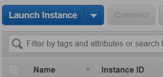
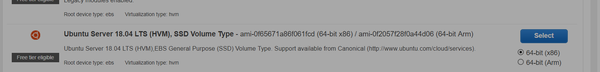
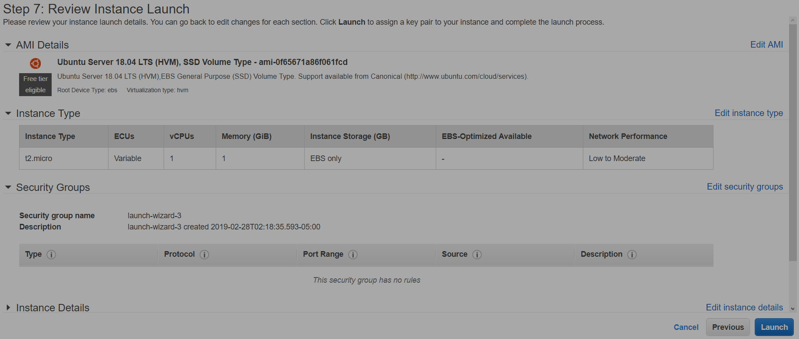
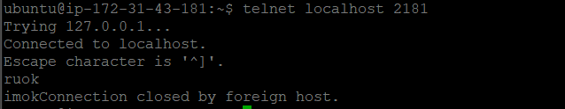
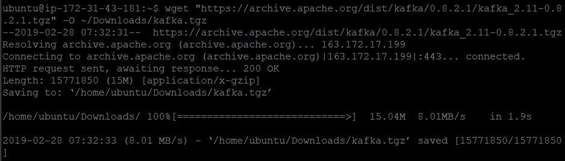
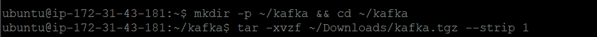
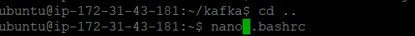
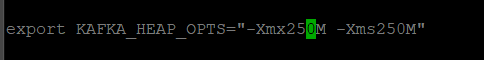
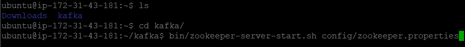
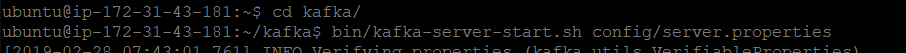

<https://www.digitalocean.com/community/tutorials/how-to-install-apache-kafka-on-ubuntu-14-04>

<https://dzone.com/articles/installing-and-running-kafka-on-an-aws-instance>

<https://www.tutorialspoint.com/apache_kafka/apache_kafka_installation_steps.htm>

<https://www.tutorialspoint.com/apache_kafka/apache_kafka_basic_operations.htm>

open all links.

Create ubuntu instance on aws and launch it

{width="2.741903980752406in" height="1.3001126421697289in"}

{width="6.5in" height="0.7888888888888889in"}

{width="6.5in" height="2.7645833333333334in"}

Open SSH client(or putty)

Install JAVA:

sudo apt-get update

{width="6.5in" height="0.1986111111111111in"}

sudo apt-get install openjdk-8-jdk

{width="5.975517279090114in" height="0.1833497375328084in"}

Step 3 — Install ZooKeeper

Apache ZooKeeper is an open source service built to coordinate and
synchronize configuration information of nodes that belong to a
distributed system. A Kafka cluster depends on ZooKeeper to
perform—among other things—operations such as detecting failed nodes and
electing leaders.

Since the ZooKeeper package is available in Ubuntu's default
repositories, install it using apt-get.

sudo apt-get install zookeeperd

{width="5.208784995625547in" height="0.2000174978127734in"}

After the installation completes, ZooKeeper will be started as a daemon
automatically. By default, it will listen on port **2181**.

To make sure that it is working, connect to it via Telnet:

telnet localhost 2181

At the Telnet prompt, type in ruok and press ENTER.

If everything's fine, ZooKeeper will say imok and end the Telnet
session.

{width="5.317127077865267in"
height="1.033423009623797in"}

Step 4 — Download and Extract Kafka Binaries

Now that Java and ZooKeeper are installed, it is time to download and
extract Kafka.

To start, create a directory called Downloads to store all your
downloads.

mkdir -p \~/Downloads

{width="4.100355424321959in" height="0.16668088363954506in"}

From this link <https://archive.apache.org/dist/kafka/0.8.2.1/> download
<https://archive.apache.org/dist/kafka/0.8.2.1/kafka_2.11-0.8.2.1.tgz>

wget
"[**https://archive.apache.org/dist/kafka/0.8.2.1/kafka\_2.11-0.8.2.1.tgz**](https://archive.apache.org/dist/kafka/0.8.2.1/kafka_2.11-0.8.2.1.tgz)"
-O \~/Downloads/kafka.tgz

{width="6.5in" height="1.854861111111111in"}

mkdir -p \~/kafka && cd \~/kafka

tar -xvzf \~/Downloads/kafka.tgz --strip 1

{width="6.5in" height="0.40347222222222223in"}

Step 5 — Configure the Kafka Server
-----------------------------------

The next step is to configure the Kakfa server.

nano \~/kafka/config/server.properties

{width="6.283877952755906in"
height="0.19168307086614172in"}

By default, Kafka doesn't allow you to delete topics. To be able to
delete topics, add the following line at the end of the file:

delete.topic.enable = true

Since Kafka uses Zookeeper, we need to first start a Zookeeper server.
We can use the convenience script packaged with Kafka to start a
single-node Zookeeper instance or we can start Zookeeper on a standalone
instance and specify its configurations
in **zookeeper.properties **configuration file, we would be starting it
using the convenience script that is packaged with Kafka. Since we have
1 GB RAM we would be setting **KAFKA\_HEAP\_OPTS** environment variable
in our **.bashrc** to 50% of total RAM ie 250 MB in our case.

nano .bashrc

{width="4.392047244094488in"
height="0.38336614173228345in"}

Insert the following environment variable.

export KAFKA\_HEAP\_OPTS="-Xmx250M –Xms250M"

{width="4.033683289588802in" height="0.5000437445319335in"}

After setting the variable, source your .baschrc.

source .bashrc

Step 6: Start ZooKeeper

bin/zookeeper-server-start.sh config/zookeeper.properties

{width="6.5in" height="0.6604166666666667in"}

To start Kafka Broker, type the following command in new terminal –

bin/kafka-server-start.sh config/server.properties

{width="6.5in" height="0.38055555555555554in"}
