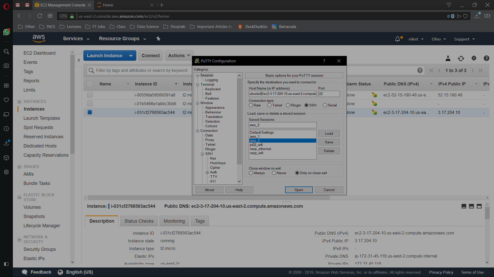
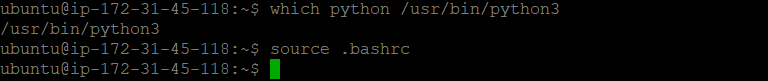

**Download Anaconda 3 installer **

wget
[*https://repo.continuum.io/archive/Anaconda3-4.4.0-Linux-x86\_64.sh*](https://repo.continuum.io/archive/Anaconda3-4.4.0-Linux-x86_64.sh)

** Install Anaconda3 by typing:**

bash Anaconda3-4.4.0-Linux-x86\_64.sh

To switch your environment to use Python 3 type the command:

which python /usr/bin/python

source .bashrc

**Create your Jupyter/Ipython password:**

ipython

from IPython.lib import passwd

passwd()

**save your SHA hash for future reference by copying and pasting it to a
text file, you’ll need this later**

sha1:1934e8c03760:6487537af42bb75cd7c3a094d167135d83cac375

**Configure Jupyter/Ipython server to access your notebooks from local
computer via internet browser:**

jupyter notebook --generate-config

Generate key & cert into the jupyter configuration folder:

openssl req -x509 -nodes -days 365 -newkey rsa:1024 -keyout
\~/.jupyter/key.key -out \~/.jupyter/cert.pem

**Edit your Jupyter configuration file:**

nano .jupyter/jupyter\_notebook\_config.py

c = get\_config()\
\
\# Kernel config\
c.IPKernelApp.pylab = 'inline' \# if you want plotting support always in
your notebook\
\
\# Notebook config\
import os

c.NotebookApp.keyfile = os.path.expanduser('\~') + '/.jupyter/key.key'

c.NotebookApp.certfile = os.path.expanduser('\~') + '/.jupyter/cert.pem'

\#location of your certificate file\
c.NotebookApp.ip = '0.0.0.0'\
c.NotebookApp.open\_browser = False \#so that the ipython notebook does
not opens up a browser by default\
c.NotebookApp.password = u'
sha1:1934e8c03760:6487537af42bb75cd7c3a094d167135d83cac375' \#edit this
with the SHA hash that you generated after typing in Step 9\
\# This is the port we opened in Step 3.\
c.NotebookApp.port = 8081

**Create a folder for your notebooks and start Jupyter Notebook:**

mkdir Notebooks\
cd Notebooks

jupyter notebook

In browser:

<https://ec2-3-17-204-10.us-east-2.compute.amazonaws.com:8081/>

Click Continue Anyway

